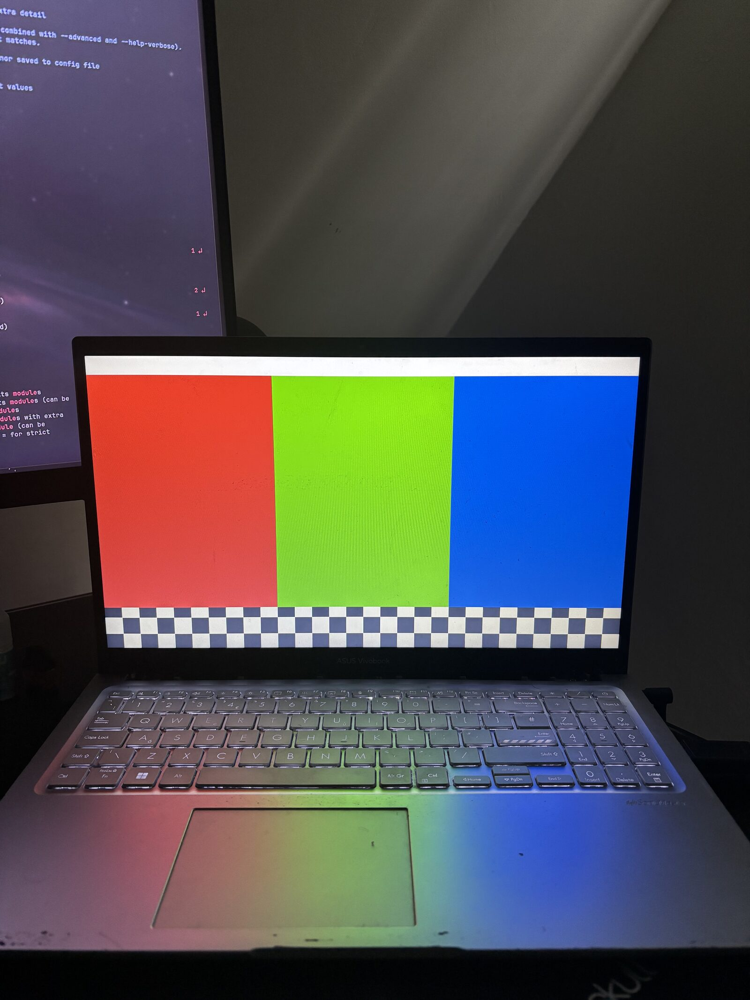

# the-os

## overview

the-os is an x86_64 OS written in rust (2024 edition). it uses GRUB to boot. currently, for testing, it boots directly into an i915 gpu test screen. logs are sent thru serial and framebuffer (before the i915 test card shows)

this repo is the monorepo of my microkernel + its current userspace

screenshot of i915 running on real hardware:



## requirements

`rustup`, cargo nightly, `rust-src` component, `lld`, `x86_64-elf-ld`, `x86_64-elf-strip`, `nasm`, `cmake`, `make`, `grub-mkrescue`, `xorriso`, `mtools`, `dosfstools`, `dd`, `qemu-system-x86_64`

### arch install command

```sh
sudo pacman -S rustup nasm cmake make lld grub xorriso mtools dosfstools qemu-system-x86
rustup toolchain install nightly
rustup component add rust-src --toolchain nightly
yay -S x86_64-elf-binutils # AUR helper, paru works too
```

## how to build

### bare metal

use the makefiles `usb-img` target to create a usb.img file in which you can boot off. i like to use ventoy on a usb stick to test.

### qemu

`make run` will build and run the project using qemu-system-x86_64.

## layout

```
src/        kernel and bootloader code
user/       userspace code
vendors/    third party code for lwext4 and openbsd-drm
fsroot/     files in the disk image, bin/ for example and lib/firmware/ etc
linker.ld   kernel linker script
Makefile    build + iso + usb-img + qemu stuff
```

## current state

currently a lot of dirty files are in development on my machine, uncommited and unpushed. i am midway porting OpenBSD's i915 driver. my previous testing laptop ran out of life the other week so i am currently stuck on testing and development.

the-os has only been tested via make run's qemu settings and my laptop which had a i7-1255U, dual channel memory usage so Iris Xe graphics (relevant for i915 work)

## contribution

all contributions are welcome! i am a 1 man team so i will manually review PRs myself.

currently there are no formal code-style requirements or PR styles, just kinda understand how code should fit into the project before wasting my time.

## license

the-os is MIT licensed, see [LICENSE](LICENSE)

code in `vendors/` keeps its own licenses. lwext4 pulls in GPL-2.0 files, so the `fs` service is GPL-2.0.

## updates

most updates and devlogs/content will be uploaded to [youtube](https://www.youtube.com/@mystyy01).
